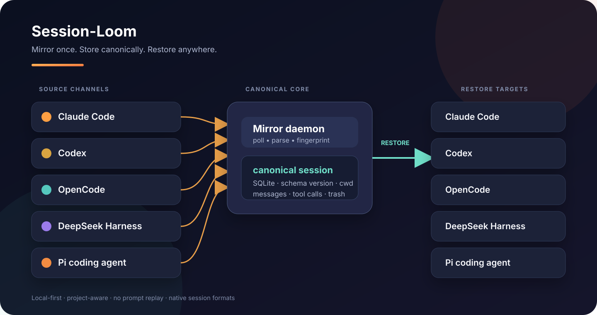

<p align="center">
  
</p>

<h1 align="center">Session-Loom</h1>

<p align="center">
  <strong>把 AI coding agent 的会话，变成真正可迁移的工作资产。</strong><br />
  Mirror once. Store canonically. Restore anywhere.
</p>

<p align="center">
  <a href="https://github.com/JC0v0/session-loom"></a>
  
  
  
</p>

<p align="center">
  <a href="#快速开始">快速开始</a> ·
  <a href="#支持的渠道">支持渠道</a> ·
  <a href="#cli-用法">CLI</a> ·
  <a href="#参与贡献">参与贡献</a>
</p>

<p align="center">
  
</p>

## 一句话理解

Session-Loom 是一个 **local-first 的 AI coding session bridge**：它持续读取 Claude Code、Codex、OpenCode、DeepSeek Harness 和 Pi 的私有会话存储，把对话、工具调用、工作目录和时间线镜像进统一的 canonical SQLite；需要时，再写回目标工具自己的原生格式。

> 不复制粘贴上下文，不重新执行工具调用，不把一套 agent 锁死在一个工具里。

## 为什么需要它？

<table>
  <tr>
    <td width="33%" valign="top">
      <h3>🧵 保留上下文</h3>
      <p>用户消息、助手回复、工具调用和输出统一归档，迁移时不需要重新解释上下文。</p>
    </td>
    <td width="33%" valign="top">
      <h3>📁 保留项目</h3>
      <p>会话的工作目录会跟随迁移，并写入各渠道自己的项目索引与原生元数据。</p>
    </td>
    <td width="33%" valign="top">
      <h3>↩️ 随时回退</h3>
      <p>删除操作进入 30 天回收站，源文件、canonical 镜像和墓碑机制共同避免误删与自回声。</p>
    </td>
  </tr>
</table>

## 支持的渠道

| 渠道 | 读取来源 | 恢复方式 | 项目归属 |
|---|---|---|---|
| **Claude Code** | `~/.claude/projects` | JSONL + `history.jsonl` | 编码后的项目目录与 history 索引 |
| **Codex** | `~/.codex/sessions` | 原生 rollout JSONL | `session_meta.payload.cwd` |
| **OpenCode** | SQLite 数据库 | 原生 SQLite session / message / part | project、project_directory、session.directory |
| **DeepSeek Harness** | `~/.dsh/sessions` | JSONL / zstd session log | session header + `workspace.json` |
| **Pi** | `~/.pi/agent/sessions` | 原生 Pi JSONL v3 | 项目目录与 session header `cwd` |

所有渠道都支持：**镜像、浏览、搜索、删除、回收站、恢复到其他渠道**。

## 核心能力

- **多向会话迁移**：任意支持的渠道 ↔ 任意支持的渠道。
- **持续镜像**：守护进程默认每 2 秒轮询，源数据只读，不产生回声循环。
- **统一 canonical 格式**：schema version、source tool、session id、cwd、时间线、消息与工具调用。
- **项目感知恢复**：目标渠道不仅收到对话，也会收到对应的工作目录和项目索引。
- **结构保真**：工具调用的 name、input、output 原样保留，但不会重新执行。
- **桌面端 + CLI**：Tauri 2 桌面应用与 `ssl` 命令行共用同一套 Rust domain core。
- **安全删除**：删除源会话并归档 canonical 快照，30 天内可从回收站恢复。

## 快速开始

### 环境要求

- Rust `>= 1.77.2`（建议最新 stable）
- Node.js（用于 npm 脚本与 Tauri CLI）
- Windows 桌面端需要 WebView2

### 安装

```bash
git clone https://github.com/JC0v0/session-loom.git
cd session-loom
npm install
```

### 启动桌面应用

首次编译可能需要几分钟：

```bash
npm run desktop
```

### 直接使用 CLI

```bash
npm start -- list
npm start -- daemon start
npm start -- restore --to codex
npm start -- trash list
```

## CLI 用法

```text
ssl daemon [run|start|stop|status]        管理后台镜像守护进程
ssl restore --to <codex|claude|opencode|dsh|pi> [id]
                                          恢复会话到目标工具；省略 id 时取最近一条
ssl list [--tool <codex|claude|opencode|dsh|pi>]
                                          列出 canonical 会话
ssl search <关键词…>                      按内容或目录搜索会话
ssl export <id>                           导出一条会话的 canonical JSON
ssl delete <id>                           删除会话并归档进回收站
ssl trash list                            列出回收站条目
ssl trash restore <id>                    恢复回收站中的会话
ssl trash delete <id>                     彻底删除回收站中的会话
```

退出码：成功 `0`，运行失败 `1`，用法错误 `2`。

## 桌面应用

桌面端提供：

- 全部 / Codex / Claude / OpenCode / DSH / Pi 渠道筛选
- 会话卡片：标题、消息数量、更新时间、工作目录
- 对话详情与可折叠工具调用
- 一键恢复到其他工具继续对话
- 删除、回收站恢复与彻底删除
- 顶栏守护进程状态与开关
- 启动时检查 GitHub Releases，支持签名更新与自动重启

## 架构

Rust workspace 的三个 crate 共享同一套领域逻辑：

```text
session-loom/
├── crates/
│   ├── session-loom-core/     # canonical、适配器、SQLite、watcher、恢复、回收站
│   └── session-loom-cli/      # ssl CLI，仅负责参数解析与命令编排
├── src-tauri/                 # Tauri 2 桌面壳
│   └── binaries/              # 构建时注入 ssl 边车二进制
├── ui/                        # 原生 HTML/CSS/JS 桌面界面
│   └── emotion-ball/          # 守护进程状态指示器使用的嵌入式表情引擎
└── docs/plans/                # 设计与规划文档
```

三条路径共享同一个 canonical store：

```text
源工具存储 ──▶ watcher / adapter ──▶ canonical SQLite ──▶ restore adapter ──▶ 目标工具原生存储
                                      │
                                      ├── CLI
                                      ├── Tauri desktop
                                      └── trash / search / export
```

## 数据位置与环境变量

运行时数据全部存放在仓库之外：

| 内容 | 默认位置 | 覆盖变量 |
|---|---|---|
| canonical 存储 | `~/.session-loom/` | `SESSION_LOOM_STORE` |
| 回收站 | `~/.session-loom/trash/` | 随 `SESSION_LOOM_STORE` |
| Codex 会话 | `~/.codex/sessions` | `CODEX_SESSIONS_ROOT` |
| Claude Code 会话 / 恢复根目录 | `~/.claude/projects` / `~/.claude` | `CLAUDE_ROOT` |
| OpenCode 数据库 | `<data>/opencode/opencode.db` | `OPENCODE_DB`、`OPENCODE_DATA_DIR` |
| DeepSeek Harness 会话 | `~/.dsh/sessions` | `DSH_SESSIONS_ROOT`、`DSH_HOME` |
| Pi 会话 | `~/.pi/agent/sessions` | `PI_CODING_AGENT_DIR`、`PI_CODING_AGENT_SESSION_DIR` |

> 会话数据库、对话内容和凭据都属于本地隐私数据，请勿提交到仓库。

## 开发与质量

```bash
npm test
cargo fmt --all -- --check
cargo clippy --workspace --all-targets -- -D warnings
```

打包发布：

```bash
npm run dist        # Windows NSIS 安装包
npm run dist:mac    # macOS .app 与 DMG
```

桌面端更新使用 Tauri updater，从 GitHub Releases 获取签名更新包。发布前需要在仓库的 GitHub Actions Secrets 中配置：

- `TAURI_SIGNING_PRIVATE_KEY`：`npx tauri signer generate` 生成的私钥内容
- `TAURI_SIGNING_PRIVATE_KEY_PASSWORD`：私钥密码；未设置密码时留空
- `APPLE_CERTIFICATE`：Developer ID Application 证书导出的 `.p12` 文件，经 base64 编码后的内容
- `APPLE_CERTIFICATE_PASSWORD`：导出 `.p12` 时设置的密码
- `KEYCHAIN_PASSWORD`：GitHub Actions 临时钥匙串使用的随机密码
- `APPLE_ID`：Apple Developer 账号邮箱
- `APPLE_PASSWORD`：该 Apple ID 的 App 专用密码，不是登录密码
- `APPLE_TEAM_ID`：Apple Developer Team ID

证书、密码和私钥只应保存为 GitHub Secret，不要提交到仓库。Tauri 更新私钥必须与 `src-tauri/tauri.conf.json` 中的公钥匹配，否则更新包会被拒绝。macOS 发布任务会导入 Developer ID 证书，分别公证应用和 DMG，并在上传前检查签名、公证票据和 Gatekeeper 结果；缺少任意凭据时发布会直接失败。

准备正式版本：

```bash
npm run release:prepare -- v0.1.2
# 如需把更新说明写入 annotated tag：
# npm run release:prepare -- v0.1.2 --notes-file path/to/release-notes.md

git push origin main
git push origin v0.1.2
```

该命令要求工作区干净且当前分支为 `main`，会同步 Node、Rust、Tauri 版本，运行格式检查、测试和 Clippy，创建版本提交与 annotated tag，但不会自动推送。

## 设计原则

- **统一中间格式，而不是两两直连转换**：新增渠道只需增加一对读写适配器。
- **镜像与恢复分离**：守护进程只读镜像，恢复是显式动作。
- **结构保真，不做语义重放**：工具调用只迁移记录，不自动执行。
- **只搬对话，不搬提示词**：目标工具继续使用自己的系统提示词与项目配置。
- **删除可回退**：源删除失败不影响 canonical 归档，数据始终有兜底。

## 已知局限

- 各工具的会话格式私有且未稳定文档化，工具升级可能需要更新适配器。
- 当前只支持同一台机器上的迁移，跨机同步与统一归档检索仍在规划中。
- 恢复会话不会复制项目文件、依赖或凭据，只迁移会话记录与项目归属元数据。

## 参与贡献

欢迎通过 Issue 或 Pull Request 参与：

1. 先描述目标工具版本与实际会话文件结构。
2. 为适配器变化补充隔离的 Rust 测试。
3. 提交前运行 `npm test`、`cargo fmt` 和 Clippy。
4. 不要提交会话数据库、凭据、用户对话或生成的 CLI 二进制。

仓库贡献约定：[AGENTS.md](AGENTS.md)

> `docs/plans/` 为本地设计记录，不随公开仓库发布。

## 许可证

本项目采用 [MIT License](LICENSE) 开源。
