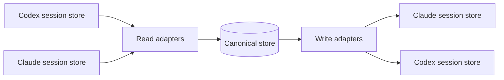

# Session Loom - Plan

## Goal Capsule

- **Objective:** Continuously mirror Claude Code and Codex sessions into a durable, versioned canonical format, and restore a canonical session into either tool as a natively resumable session.
- **Product authority:** The user (solo, single machine). Scope decisions are confirmed by the user.
- **Open blockers:** None.
- **Execution profile:** Code; a TypeScript/Node.js CLI plus a long-lived background daemon.
- **Stop conditions:** A real Codex session and a real Claude Code session each mirror to the canonical store and restore into the other tool as a natively resumable session.

---

## Product Contract

Product Contract changed: interface requirements split (R8 → R8–R12) and flows updated for the background-daemon plus restore architecture, confirmed during planning.

### Summary

A local background service plus CLI that keeps Claude Code and Codex sessions continuously mirrored into one durable, versioned canonical session format, and restores a canonical session into either tool as a natively resumable session. It migrates the conversation only, not either tool's system prompt.

### Problem Frame

Claude Code and Codex keep sessions in separate private formats, and neither tool offers a first-party import path in both directions. The user reports Codex can import Claude sessions, but not the reverse, so a task started in one tool cannot be picked up in the other without manually re-explaining context or copy-pasting history. This plan addresses the missing conversation-level migration.

### Key Decisions

- **Canonical intermediate format** (session-settled: user-directed — chosen over direct pairwise translators and a degrade-first tool: enables future adapters and reuses the canonical form for archive/sharing). Governs R3.
- **Bidirectional in v1** (session-settled: user-directed — chosen over one-direction-first). Governs R1, R2.
- **Migrate the conversation only, not the system prompt** (session-settled: user-directed — the user excluded prompt migration). Governs R4.
- **No degradation tier in v1** (session-settled: user-directed — the user deferred fallback handling). Governs R5.
- **Native resume into each tool's own store** (session-settled: user-approved — the agent surfaced the private-format risk; the user confirmed). Governs R6, R7.

### Requirements

**Conversion**

- R1. A Codex-to-Claude Code conversion takes one selected Codex session and produces a resumable Claude Code session.
- R2. A Claude Code-to-Codex conversion takes one selected Claude Code session and produces a resumable Codex session.
- R3. Both directions convert through a single canonical session representation shared by every adapter.

**Fidelity**

- R4. Migrated content is the conversation — user/assistant turns and their tool-call and action records — excluding the source tool's system prompt.
- R5. The target session preserves the conversation's task, prior decisions, and current state well enough for the target agent to continue without re-explaining the context.

**Resume integration**

- R6. A Codex-to-Claude Code result is listed and resumable by Claude Code's native session picker.
- R7. A Claude Code-to-Codex result is listed and resumable by Codex's native session picker.

**Continuous mirror**

- R8. The tool runs as a long-lived background process that watches both tools' session stores and detects new or changed sessions.
- R9. The background process converts each detected session into the canonical format and persists it in a dedicated store outside the watched directories, without writing into either tool's session store.
- R10. The canonical format is durable and versioned so a session can be restored or synced later.

**Interface**

- R11. A command-line interface runs the background process and reports its outcome with plain success or failure output.
- R12. A restore command selects a canonical session and materializes a resumable native session in the target tool, in either direction, reporting the created session.

### Key Flows

- F1. Continuous mirror
  - **Trigger:** The background process is running.
  - **Steps:** Watch both session stores; on a new or changed session, convert it to the canonical format and persist it in the canonical store.
  - **Outcome:** The canonical store reflects every session from both tools.
  - **Covered by:** R8, R9, R10.

- F2. Restore to Claude Code
  - **Trigger:** The user runs the restore command targeting Claude Code.
  - **Steps:** Select a canonical session; emit a Claude Code session and register it in Claude Code's resume index.
  - **Outcome:** `claude --resume` lists the new session.
  - **Covered by:** R1, R3, R6, R12.

- F3. Restore to Codex
  - **Trigger:** The user runs the restore command targeting Codex.
  - **Steps:** Select a canonical session; emit a Codex session in Codex's store.
  - **Outcome:** `codex resume` lists the new session.
  - **Covered by:** R2, R3, R7, R12.

### Acceptance Examples

- AE1. Given a Codex session with user and assistant turns and tool calls, when the daemon mirrors it and the user restores it to Claude Code, then `claude --resume` lists it, the conversation is preserved, and the resumed agent can state the task and its progress. Covers R1, R4, R5, R6.
- AE2. Given a Claude Code session, when the daemon mirrors it and the user restores it to Codex, then `codex resume --all` lists it and the conversation is preserved. Covers R2, R4, R5, R7.
- AE3. Given a source session whose tool has a system prompt, when converted, then the canonical session and the target session do not contain that system prompt. Covers R4.
- AE4. Given the user runs restore without an id, when most-recent is selected, then the most recent canonical session is used. Covers R12.
- AE5. Given the daemon persists to the canonical store only, when it writes a canonical session, then neither watched store emits a new event, so the mirror does not self-echo. Covers R9.

### Success Criteria

- A real Codex session mirrors to the canonical store and restores to a Claude Code session that `claude --resume` lists and that continues the same task without re-explaining the context.
- A real Claude Code session mirrors to the canonical store and restores to a Codex session that `codex resume --all` lists and that continues the same task.

<!-- ce-section: work-relationships -->
### How This Work Fits Together

This plan owns one area of the broader unified coding-agent session idea: continuous Claude Code-to-Codex conversation migration through a durable canonical format. The breakdown below is the current understanding, not a committed roadmap.

- Claude Code-to-Codex conversation bridge — this plan.
  - OpenCode adapter — Depends on the canonical session representation defined here; deferred.
  - Unified archive and search — Shares the canonical session representation; deferred.
  - Project context and memory migration — Still to decide whether it reuses the canonical form; deferred.
  - Cross-machine session sync — Depends on the durable canonical format defined here; deferred.

### Scope Boundaries

**Deferred for later**

- OpenCode support.
- Unified archive and search across tools.
- Project context and memory migration.
- Cross-machine session sync.
- GUI or web interface.

### Dependencies / Assumptions

- The two tools' session formats are private and undocumented; the tool tracks a specific format per tool version and may break when a tool changes format.
- "Conversation" means the message and turn history including tool-call and action records, excluding the system prompt.
- Source and target sessions live on the same machine, and both tools' CLIs are installed.
- The background process is a single local process, not a Windows service; it runs while the user is logged in.

### Outstanding Questions

- Deferred to Implementation: the exact watcher mechanism and its debounce or dedup behavior.
- Deferred to Implementation: the final canonical field names and the precise tool-call record shape.

### Sources / Research

- Claude Code session store: `~/.claude/projects/<encoded-cwd>/<uuid>.jsonl`, a JSONL of typed records (`mode`, `permission-mode`, `file-history-snapshot`, and user/assistant/tool-use entries); the `~/.claude/history.jsonl` index (`{display, timestamp, project, sessionId}`) drives `claude --resume`.
- Codex session store: `~/.codex/sessions/YYYY/MM/DD/rollout-<ts>-<uuid>.jsonl`, a JSONL of `session_meta` (which carries the Codex system prompt and cwd), `event_msg`, and `response_item` records in the Responses API shape.
- CLIs: `codex resume [SESSION_ID]` with `--last` and `--all`; `claude --resume <id>` and `--continue`.
- Local installs observed: Claude Code 2.1.227 and Codex 0.147.0-alpha.6.5 (this Codex build has no visible `import` or `claude` subcommand).

---

## Planning Contract

### Key Technical Decisions

- KTD1. **TypeScript/Node.js** (session-settled: user-directed — chosen over Python, Go, and Rust: Node matches Claude Code's ecosystem and the user's environment). Governs U1–U7.
- KTD2. **Long-lived background daemon plus a control CLI** (session-settled: user-directed — the user specified a continuously running background process rather than a one-shot command). Governs R8, R9, R12.
- KTD3. **Mirror-only daemon, with restore as a separate on-demand command** (session-settled: user-directed — chosen over auto-generating the target tool's native session: avoids a self-echo loop and keeps restore on demand). Governs R9, R12.
- KTD4. **Durable, versioned canonical format persisted outside the watched directories** (session-settled: user-directed — the user required the canonical form for restore and future sync). Governs R10; cites R3.
- KTD5. **Tool calls are preserved structurally, not re-executed.** The canonical format records each tool call's name and inputs/outputs verbatim; write adapters re-emit them in the target tool's shape without executing them. Governs R4, R5.
- KTD6. **Canonical store layout and target-project derivation.** One versioned file per source session, keyed by source tool and session id, in a dedicated store outside the watched directories; the Claude restore target project is derived from the recorded cwd, encoded the way Claude Code encodes project paths. Governs R9, R10, R12.
- KTD7. **Three-command CLI surface.** The public contract is `daemon`, `restore --to <claude|codex>`, and `list`, with plain output and the exit codes defined in the CLI Contract. Governs R11, R12.

### High-Level Technical Design

The daemon runs the left half continuously; the restore command runs the right half on demand.



The canonical store lives outside both watched stores. The daemon never writes into a watched store, so mirroring does not self-echo. The restore command writes once into the target store; the resulting mirror of the restored session is idempotent.

### Output Structure

```text
session-bridge/
├── package.json
├── tsconfig.json
├── vitest.config.ts
└── src/
    ├── cli.ts
    ├── canonical/
    │   ├── types.ts
    │   └── serialize.ts
    ├── adapters/
    │   ├── codex/
    │   │   ├── read.ts
    │   │   └── write.ts
    │   └── claude/
    │       ├── read.ts
    │       └── write.ts
    ├── store/
    │   └── store.ts
    └── daemon/
        ├── watch.ts
        └── mirror.ts
```

### CLI Contract

The CLI is the tool's public interface. Commands print plain text and use the exit codes below.

**Global options**

- `-h, --help` prints command help.
- `-V, --version` prints the version.

**daemon**

`session-bridge daemon [start|stop|status]`

- `start` starts the background watcher as a detached process; no-op when already running.
- `stop` stops the running watcher.
- `status` prints `running` or `stopped`.
- No subcommand defaults to `start`.

**restore**

`session-bridge restore --to <claude|codex> [session-id]`

- `--to` is required and accepts `claude` or `codex`.
- `[session-id]` is optional; omitted means the most recent canonical session.
- On success prints the created target session id and path.
- On failure prints a plain error.

**list**

`session-bridge list [--tool <claude|codex>]`

- `--tool` optionally filters by source tool.
- Prints one line per canonical session: session id, source tool, cwd, updated time.
- Exits 0 even when the list is empty.

**Exit codes**

- `0` success.
- `1` runtime failure (session missing, parse or write failed).
- `2` usage error (unknown command or flag, invalid `--to`, missing required flag).

### Assumptions

- The canonical store lives outside both tools' watched directories.
- Session detection is file-based: a session is a JSONL file in a tool's session store.

### Sequencing

U1 → U2 → U3 → U4 → U5 → U6 → U7. Read and write adapters (U3, U6) depend on the canonical model (U2); the daemon (U5) depends on read adapters and the store (U3, U4); the CLI and end-to-end wiring (U7) depend on everything upstream.

---

## Implementation Units

### U1. Project scaffold and test harness

- **Goal:** Establish the TypeScript project with a CLI entry point and a test runner.
- **Requirements:** none.
- **Dependencies:** none.
- **Files:** `package.json`, `tsconfig.json`, `vitest.config.ts`, `src/cli.ts`
- **Approach:** Set up a Node TypeScript project with a runnable CLI stub, strict type checking, and a vitest test runner wired to `npm test`.
- **Test scenarios:** `Test expectation: none — scaffolding; verified by typecheck and a stub CLI smoke run.`

### U2. Canonical session model and versioning

- **Goal:** Define the canonical session schema with a schema version and serialization.
- **Requirements:** R3, R10.
- **Dependencies:** U1.
- **Files:** `src/canonical/types.ts`, `src/canonical/serialize.ts`, `src/canonical/serialize.test.ts`
- **Approach:** Model a canonical session as a versioned record with source tool, session id, cwd, timestamps, and an ordered message list; each message has a role, text, and an ordered list of tool-call records (id, name, input, optional output).
- **Test scenarios:**
  - Serialize then deserialize a canonical session and preserve every field.
  - Reject a canonical file whose schema version is unknown.

### U3. Read adapters

- **Goal:** Parse Codex and Claude Code session JSONL into the canonical model.
- **Requirements:** R3, R4.
- **Dependencies:** U2.
- **Files:** `src/adapters/codex/read.ts`, `src/adapters/claude/read.ts`, `src/adapters/codex/read.test.ts`, `src/adapters/claude/read.test.ts`
- **Approach:** Read a Codex session's `response_item` records and a Claude Code session's user/assistant message entries, map tool calls to the canonical tool-call record, and drop the source system prompt.
- **Test scenarios:**
  - A fixture Codex session with tool calls produces a canonical session with tool calls and no system prompt.
  - A fixture Claude session produces a canonical session; mode, permission, and file-history entries are ignored.
  - A source system prompt does not appear in the canonical output.

### U4. Canonical store

- **Goal:** Persist and deduplicate canonical sessions in the dedicated store.
- **Requirements:** R9, R10.
- **Dependencies:** U2.
- **Files:** `src/store/store.ts`, `src/store/store.test.ts`
- **Approach:** Key each canonical file by source tool and session id under a store directory outside the watched directories; rewrite idempotently on change.
- **Test scenarios:**
  - Write then read a canonical session and get the same content.
  - Re-mirroring an unchanged session is a no-op.

### U5. Daemon watcher and mirror pipeline

- **Goal:** Watch both stores and mirror new or changed sessions into the canonical store.
- **Requirements:** R8, R9.
- **Dependencies:** U3, U4.
- **Files:** `src/daemon/watch.ts`, `src/daemon/mirror.ts`, `src/daemon/watch.test.ts`
- **Approach:** Watch both session directories, debounce events, and on each event run the matching read adapter and persist to the canonical store. The canonical store is outside the watched directories, so mirroring does not re-trigger.
- **Test scenarios:**
  - A new session file in a fixture directory appears in the canonical store.
  - Writing to the canonical store produces no new watcher event.
  - A session that grows re-mirrors to reflect the appended content.

### U6. Write adapters

- **Goal:** Emit a resumable native session from a canonical session for both targets.
- **Requirements:** R1, R2, R6, R7, R12.
- **Dependencies:** U2.
- **Files:** `src/adapters/codex/write.ts`, `src/adapters/claude/write.ts`, `src/adapters/codex/write.test.ts`, `src/adapters/claude/write.test.ts`
- **Approach:** Emit a Codex session with `session_meta` and `response_item` records; emit a Claude Code session plus a `history.jsonl` index entry. Derive the Claude target project from the recorded cwd.
- **Test scenarios:**
  - A canonical session with tool calls emits a Codex JSONL containing `function_call` records.
  - A canonical session emits a Claude Code JSONL plus a matching history entry.
  - The restored Codex session is listed by `codex resume --all`; the restored Claude session is listed by `claude --resume`.

### U7. CLI commands and end-to-end wiring

- **Goal:** Wire the daemon, restore, and list commands and verify the full mirror-plus-restore loop.
- **Requirements:** R11, R12.
- **Dependencies:** U5, U6.
- **Files:** `src/cli.ts`, `src/cli/restore.ts`, `src/cli/daemon.ts`, `src/cli/cli.test.ts`
- **Approach:** Implement the `daemon`, `restore`, and `list` commands exactly as specified in the CLI Contract. Restore selects a canonical session by id or most-recent.
- **Test scenarios:**
  - Restoring a mirrored Codex session to Claude Code yields a session listed by `claude --resume`.
  - Restoring a mirrored Claude session to Codex yields a session listed by `codex resume --all`.
  - Invalid input and a missing session report a plain failure.

---

## Verification Contract

- `npm run typecheck` passes with no TypeScript errors.
- `npm test` passes; every feature-bearing unit has green test scenarios.
- End-to-end smoke: mirror a fixture Codex session, run `restore --to claude`, and confirm `claude --resume` lists it; mirror a fixture Claude session, run `restore --to codex`, and confirm `codex resume --all` lists it.

---

## Definition of Done

- Every implementation unit U1–U7 is complete and its test scenarios pass.
- `npm run typecheck` and `npm test` are green.
- The end-to-end smoke passes in both directions with real fixture sessions.
- The canonical store sits outside both tools' watched directories and the daemon does not self-echo.
- No abandoned or dead-end code remains in the diff.
